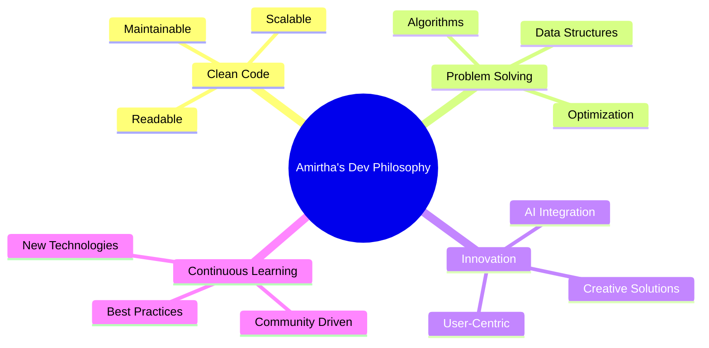

<div align="center">
  
</div>

<div align="center">
  
# 🚀 Full Stack Developer • ML Engineer • AI Enthusiast


</div>

<div align="center">
  
[](https://www.linkedin.com/in/amirtha-varshni-m-a592632a6)
[](mailto:amirtha2314@gmail.com)
[](https://github.com/amirtha-1412)

</div>


## 🎯 ABOUT ME

```javascript
const amirthaVarshni = {
    pronouns: "she" | "her",
    code: ["Python", "Java", "C++", "JavaScript", "SQL", "C"],
    askMeAbout: ["AI/ML", "Full Stack Dev", "Data Science", "Problem Solving"],
    technologies: {
        frontEnd: {
            js: ["React", "Node.js"],
            css: ["Tailwind", "Bootstrap"]
        },
        backEnd: {
            python: ["Django", "Flask", "FastAPI"],
            java: ["Spring Boot"]
        },
        dataScience: {
            tools: ["Pandas", "NumPy", "Scikit-learn", "TensorFlow"],
            visualization: ["Power BI", "Streamlit", "Matplotlib"]
        },
        devOps: ["Git", "GitHub", "Docker"],
        databases: ["MySQL", "PostgreSQL", "MongoDB"],
        misc: ["Firebase", "REST APIs", "Microservices"]
    },
    currentFocus: "Building AI-powered solutions that make a difference 🚀",
    funFact: "I debug with print statements and I'm not ashamed! 😄"
};
```


## 🔥 MY TECH STACK

<div align="center">

### 👨‍💻 Languages
<p>
  
  
  
  
  
  
</p>

### 🚀 Frameworks & Libraries
<p>
  
  
  
  
  
  
</p>

### 🛠️ Tools & Platforms
<p>
  
  
  
  
  
  
</p>

### 💾 Databases
<p>
  
  
  
</p>

</div>


## 💡 WHAT I'M FOCUSED ON

<table>
<tr>
<td width="50%">

### 🤖 AI & Machine Learning
```python
current_projects = {
    "AI_Apps": "Building intelligent systems",
    "ML_Models": "Training & deploying models",
    "Data_Analysis": "Extracting insights",
    "Automation": "Making life easier"
}
```

</td>
<td width="50%">

### 🌱 Currently Learning
```java
public class Learning {
    String[] topics = {
        "Advanced Data Science",
        "Deep Learning",
        "System Design",
        "Cloud Technologies"
    };
}
```

</td>
</tr>
</table>


## 🎨 DEVELOPMENT PHILOSOPHY

<div align="center">



</div>


## 🏆 CORE COMPETENCIES

<div align="center">

| 💻 Full Stack Development | 🤖 Machine Learning | 📊 Data Science |
|:-------------------------:|:-------------------:|:---------------:|
| Building scalable web apps | Training ML models | Data analysis & visualization |
| REST API development | Model evaluation & optimization | Statistical modeling |
| Database design | Neural networks | Business intelligence |
| Frontend & Backend | Computer vision | Predictive analytics |

</div>


## 📈 LEARNING JOURNEY

<div align="center">

| 🎯 Technology | 📊 Proficiency | 🔥 Status |
|:-------------|:--------------|:---------|
| Python | ████████████████████ 100% | ⚡ Expert |
| Java | ████████████░░░░░░░░ 65% | 📚 Learning |
| JavaScript | ██████████████░░░░░░ 75% | 🚀 Intermediate |
| Data Science | ███████████████░░░░░ 80% | 🔬 Advanced |
| Machine Learning | ██████████████░░░░░░ 75% | 🤖 Intermediate |
| Full Stack Dev | ████████████████░░░░ 85% | 💻 Advanced |

</div>


## 🎯 2025 GOALS

<div align="center">

```diff
+ Master Deep Learning & Neural Networks
+ Contribute to 50+ Open Source Projects
+ Build 10+ Production-Ready AI Applications
+ Learn Cloud Technologies (AWS/Azure)
+ Mentor Aspiring Developers
+ Write Technical Blogs & Articles
```

</div>


## 💼 LET'S BUILD SOMETHING AMAZING TOGETHER

<div align="center">

### 🤝 Open to Collaborate On:
🔹 AI/ML Projects • 🔹 Open Source Contributions • 🔹 Full Stack Applications<br>
🔹 Data Science Research • 🔹 Hackathons • 🔹 Innovative Solutions

<br>

### 📬 Reach Out To Me:

<a href="https://www.linkedin.com/in/amirtha-varshni-m-a592632a6">
  
</a>
<a href="mailto:amirtha2314@gmail.com">
  
</a>
<a href="https://github.com/amirtha-1412">
  
</a>
<br><br>


</div>


<div align="center">

### ⚡ Fun Fact About Me


</div>


<div align="center">
  
### 💭 *"Code is poetry written in logic."*

<br>


</div>
