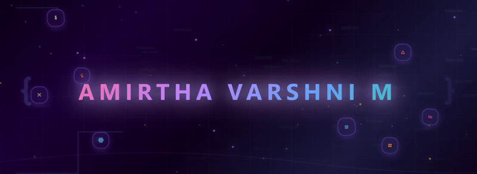

 
<!-- Banner -->

  

<!-- Typing Effect -->

  

 
  <!-- Profile Views -->
  

  <!-- LinkedIn -->
  

  <!-- LeetCode -->
  

  <!-- CodeChef -->
  

  <!-- CodeForces -->
  

##  About Me  

I’m an AI & ML Developer with a strong interest in building intelligent, data-driven systems and modern web applications.  
I enjoy working at the intersection of **Machine Learning, software development, and clean UI/UX design**, creating solutions that are both functional and elegant.

-  Experienced in Python, building ML models, visual dashboards, and intuitive full-stack applications 
-  Skilled in crafting smooth front-end experiences with React & Streamlit  
-  Strong interest in deep learning, automation & efficient problem-solving  
-  Passionate about Deep Learning, analytics, and futuristic tech innovation  
-  Continuously learning, improving, and building real-world AI applications

##  GitHub Stats

  
  

##  Tech Stack
###  Programming Languages & Core Concepts 

  
 

 
 

###  Frontend Technologies

  
  
  

###  Tools & Frameworks

  
  
  
  
  
  

##  Competitive Programming Stats  

<table>
<tr>

<!-- LeetCode -->
<td width="33%" align="center" style="vertical-align: top; padding: 15px;">

<h3>LeetCode</h3>

 

</td>

<!-- CodeChef -->
<!-- CodeChef -->
<td width="33%" align="center" style="vertical-align: top; padding: 15px;">

<h3>CodeChef</h3>

<!-- CodeChef Logo -->

  

<!-- Stats Grid (Manually Filled) -->

  

</td>

<!-- Codeforces -->
<td width="33%" align="center" style="vertical-align: top; padding: 15px;">

<h3>Codeforces</h3>

 

</td>

</tr>
</table>

##  Featured Projects  

---

<table>
<tr>

<!-- PROJECT 1 -->
<td width="50%" style="vertical-align: top; padding: 20px;">

  

  <h3>AI Notes Summarizer</h3>

A modern summarization system supporting extractive and abstractive techniques using Transformer-based NLP models.  
Built with an elegant Streamlit interface for real-time, clean summarization.

**Key Features**  
- Extractive + Abstractive summarization  
- Transformer NLP pipeline  
- Handles long text efficiently  
- Real-time Streamlit UI  

**Tech Stack**  

</td>

<!-- PROJECT 2 -->
<td width="50%" style="vertical-align: top; padding: 20px;">

  

  <h3>Taxi Fare Prediction (Machine Learning)</h3>

A regression-based ML system predicting taxi fares using distance, duration, and passenger count, supported by a clean Streamlit UI.

**Key Features**  
- Regression ML pipeline  
- Feature engineering  
- Interactive prediction UI  
- Model performance evaluation  

**Tech Stack**  

</td>

</tr>
<tr>

<!-- PROJECT 3 -->
<td width="50%" style="vertical-align: top; padding: 20px;">

  

  <h3>AI-Powered Smart Door Lock (IoT + AI)</h3>

A smart IoT-based access control system integrating PIR sensing, RFID scanning, and an offline AI-driven Risk Evaluation Engine.

**Key Features**  
- Multi-factor auth (PIR + RFID)  
- AI-based local risk scoring  
- Low-latency servo control  
- LED-based feedback system  

**Tech Stack**  

</td>

<!-- PROJECT 4 -->
<td width="50%" style="vertical-align: top; padding: 20px;">

  

  <h3>Network Intrusion Detection System (NIDS)</h3>

A machine-learning-based intrusion detection system designed to classify network behavior as normal or malicious based on engineered features.

**Key Features**  
- ML-based anomaly detection  
- Feature-engineered datasets  
- High-accuracy classification  
- Lightweight, scalable design  

**Tech Stack**  

</td>

</tr>
</table>

---

## 🔗 Connect with Me

  
  
  

---

<picture>
  <source media="(prefers-color-scheme: dark)" srcset="https://raw.githubusercontent.com/amirtha-1412/amirtha-1412/output/github-contribution-grid-snake-dark.svg" />
  <source media="(prefers-color-scheme: light)" srcset="https://raw.githubusercontent.com/amirtha-1412/amirtha-1412/output/github-contribution-grid-snake.svg" />
  
</picture>
