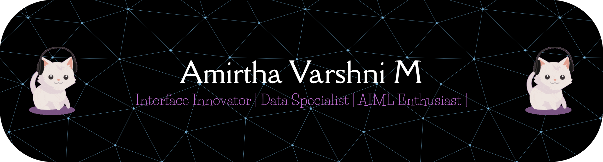

<div align="center">

<!-- ABOUT ME Section -->
<div align="center">


# Professional Summary


</div>


<div align="center">

### Hello! I'm a software developer dedicated to building robust, scalable, and intelligent solutions.

</div>

<br/>

<div align="left">
  
```yaml
Overview:
  Role: Full-Stack Developer & AI/ML Enthusiast
  Specialization:
    - Python programming and AI/ML development
    - Building robust full-stack web applications
    - Developing AI/ML solutions for real-world problems
    - Implementing scalable backend systems
    - Integrating AI/ML models into projects
    - Designing user-friendly interfaces
  
Current Focus:
  - Developing AI-powered applications like AI Legal Assistant
  - Enhancing IoT-based projects like Smart UV Door Lock
  - Building modern web applications (Portfolio, To-do App, Art Gallery)
  - Improving competitive programming skills and problem-solving

Mission: >
  Create technology solutions that deliver meaningful impact and improve user experiences

Work Philosophy:
  - Purpose-driven coding with clean and maintainable Python code
  - Continuous learning and exploring new technologies
  - Delivering high-quality, reliable, and scalable solutions


